# Agent Routing Blueprint

## Overview

This document describes the agent-based routing decision tree for handling user requests.
Instead of hardcoded keyword detection, an AI agent analyzes context and decides the routing strategy.

## Routing Decision Tree

> 💡 **Visual Version:** Open `AGENT_ROUTING_DIAGRAM.html` in your browser for an interactive, high-resolution diagram with detailed block descriptions.

```mermaid
flowchart TD
    Start([👤 User Message<br/>Received]) --> HasPrevious{📋 Has Previous<br/>Context?<br/>━━━━━━<br/>previous_request<br/>previous_response}

    HasPrevious -->|❌ NO<br/>First message| NewRequest[🆕 NEW REQUEST<br/>━━━━━━<br/>is_new_request = True<br/>operation_type = 'new'<br/>use_previous_context = False]

    HasPrevious -->|✅ YES<br/>Has context| Agent[🤖 AI AGENT<br/>Analyzes Context<br/>━━━━━━<br/>OpenAI gpt-4o-mini<br/>with structured output]

    Agent --> BothCheck{🔍 Context Analysis<br/>━━━━━━<br/>location_changed?<br/>place_type_changed?}

    BothCheck -->|Both Changed<br/>Paris parks → Munich bars| NewRequest

    BothCheck -->|Location OR Type Same<br/>Munich bars → Munich bars| ModDecision{📝 Modification<br/>Detection<br/>━━━━━━<br/>Agent analyzes<br/>user intent}

    ModDecision -->|add more<br/>one more<br/>add 2| AddOp[➕ ADD OPERATION<br/>━━━━━━<br/>operation_type = add<br/>use_previous_context = True<br/>count_adjustment = +N<br/>━━━━━━<br/>count = previous + N]

    ModDecision -->|remove last<br/>delete 2<br/>remove| RemoveOp[➖ REMOVE OPERATION<br/>━━━━━━<br/>operation_type = remove<br/>use_previous_context = True<br/>count_adjustment = -N<br/>━━━━━━<br/>count = max 1 previous - N]

    ModDecision -->|last one is far<br/>change last<br/>4th is bad| ReplaceLast[🔄 REPLACE LAST<br/>━━━━━━<br/>operation_type = replace_last<br/>use_previous_context = True<br/>━━━━━━<br/>count = previous<br/>Keep all except last]

    ModDecision -->|all are far<br/>not in center<br/>show other| ReplaceAll[🔄 REPLACE ALL<br/>━━━━━━<br/>operation_type = replace_all<br/>use_previous_context = False<br/>━━━━━━<br/>count = previous<br/>Generate new list]

    ModDecision -->|make it 3<br/>adjust time<br/>different theme| Refine[⚙️ REFINE<br/>━━━━━━<br/>operation_type = refine<br/>use_previous_context = True<br/>━━━━━━<br/>count = from classification]

    NewRequest --> Classify[🧠 CLASSIFY QUERY<br/>━━━━━━<br/>Extract location place_type<br/>count theme travel_mode]
    AddOp --> Suggest
    RemoveOp --> Suggest
    ReplaceLast --> Suggest
    ReplaceAll --> Suggest
    Refine --> Classify

    Classify --> Suggest[💡 SUGGEST PLACES<br/>━━━━━━<br/>OpenAI generates<br/>place suggestions<br/>with context]

    Suggest --> Enrich[🌍 ENRICH with Google Places<br/>━━━━━━<br/>Search by name + city<br/>Get coordinates rating<br/>Get address photos<br/>Verify city match]

    Enrich --> CountCheck{🔢 Found enough?<br/>━━━━━━<br/>enriched count<br/>equals requested count?}

    CountCheck -->|❌ NO<br/>Missing places| Retry[🔄 RETRY<br/>━━━━━━<br/>Request missing count<br/>Exclude already tried<br/>OpenAI API call]

    Retry --> Enrich

    CountCheck -->|✅ YES<br/>Got enough| Optimize[🗺️ OPTIMIZE ROUTE<br/>━━━━━━<br/>Greedy nearest-neighbor<br/>algorithm]

    Optimize --> MapGen[🗺️ GENERATE MAP DATA<br/>━━━━━━<br/>Create waypoints<br/>Generate Directions URLs<br/>Build segments<br/>Calculate travel time]

    MapGen --> Response([📤 RESPONSE<br/>━━━━━━<br/>Text + MapData<br/>to User])

    style NewRequest fill:#e3f2fd,stroke:#1976d2,stroke-width:3px
    style AddOp fill:#c8e6c9,stroke:#388e3c,stroke-width:3px
    style RemoveOp fill:#ffcdd2,stroke:#d32f2f,stroke-width:3px
    style ReplaceLast fill:#ffe0b2,stroke:#f57c00,stroke-width:3px
    style ReplaceAll fill:#f8bbd0,stroke:#c2185b,stroke-width:3px
    style Refine fill:#d1c4e9,stroke:#512da8,stroke-width:3px
    style Agent fill:#fff9c4,stroke:#f9a825,stroke-width:3px
    style Start fill:#b2dfdb,stroke:#00796b,stroke-width:3px
    style Response fill:#b2dfdb,stroke:#00796b,stroke-width:3px
    style CountCheck fill:#fff,stroke:#333,stroke-width:2px
    style Retry fill:#fff59d,stroke:#f9a825,stroke-width:3px
```



## Decision Matrix

| Scenario | Previous Context | Agent Decision | Operation Type | Count Adjustment |
|----------|------------------|----------------|----------------|------------------|
| **New city, new type** | "Parks in Paris" | NEW REQUEST | `new` | Use classified count |
| **Same context + "add"** | "5 bars in Munich" | MODIFICATION | `add` | +N (e.g., +2) |
| **Same context + "remove"** | "5 bars in Munich" | MODIFICATION | `remove` | -N (e.g., -1) |
| **Criticism of last item** | "5 bars in Munich" | MODIFICATION | `replace_last` | Same count |
| **Criticism of all** | "5 bars in Munich" | MODIFICATION | `replace_all` | Same count |
| **Adjust parameters** | "5 bars in Munich" | MODIFICATION | `refine` | Use classified count |

## Test Coverage

Each branch in the flowchart is covered by integration tests in `tests/integration/test_agent_routing.py`:

### Test Cases

1. ✅ **test_new_request_different_location_and_type**
   - Input: "parks in Paris" → "bars in Munich"
   - Expected: `is_new_request=True`, `operation_type="new"`

2. ✅ **test_add_operation**
   - Input: "5 bars in Munich" → "add 2 more"
   - Expected: `operation_type="add"`, `count_adjustment=2`

3. ✅ **test_remove_operation**
   - Input: "5 bars in Munich" → "remove last"
   - Expected: `operation_type="remove"`, `count_adjustment=-1`

4. ✅ **test_replace_last_operation**
   - Input: "5 bars in Munich" → "last one is too far"
   - Expected: `operation_type="replace_last"`, `use_previous_context=True`

5. ✅ **test_replace_all_operation**
   - Input: "5 bars in Munich" → "all are not in center"
   - Expected: `operation_type="replace_all"`, `use_previous_context=True`

6. ✅ **test_refine_operation**
   - Input: "5 bars in Munich" → "make it only 3"
   - Expected: `operation_type="refine"`, count adjusted

## Adding New Operations

To add a new operation type:

1. **Update the schema** (`app/schemas/agent.py`):
   ```python
   operation_type: str = Field(
       description="..., 'new_operation' - description"
   )
   ```

2. **Update agent prompt** (`app/services/openai_service.py`):
   ```python
   - NEW_OPERATION: When user does X
   ```

3. **Update chat service logic** (`app/services/chat_service.py`):
   ```python
   elif routing.operation_type == "new_operation":
       # Handle new operation
   ```

4. **Add test case** (`tests/integration/test_agent_routing.py`):
   ```python
   @pytest.mark.asyncio
   @pytest.mark.openai
   async def test_new_operation(openai_service):
       # Test implementation
   ```

5. **Update this diagram** - add node and edge to flowchart

## Benefits of Agent-Based Routing

- ✅ **Extensible** - add new operations by updating prompt, not code
- ✅ **Testable** - structured decisions with reasoning
- ✅ **Multilingual** - works in any language, not keyword-dependent
- ✅ **Debuggable** - reasoning field explains decisions
- ✅ **Less code** - 120 lines of if-else → 70 lines of clean logic

## Cost Estimation

Using `gpt-4o-mini` for routing decisions:
- ~500 tokens per request
- Cost: ~$0.0003 per routing decision
- 1000 requests = $0.30

Negligible compared to value provided.
